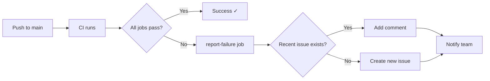

# Example: Auto-Generated CI Failure Issue

This document shows what an automatically generated issue will look like when CI fails on the main branch.

## Example Issue 1: Single Job Failure

**Title:** `CI Failure on main: lint`

**Labels:** `ci-failure`, `bug`, `needs-triage`

**Body:**
```markdown
## CI Failure Report

The following jobs failed on the main branch:
- **lint**

**Workflow Run:** https://github.com/microsoft/vscode-python/actions/runs/7234567890
**Commit:** abc123def4567890abcdef1234567890abcdef12
**Commit Message:** Add new feature for environment detection
**Author:** @contributor

Please investigate and fix the failure.

---
*This issue was automatically created by the CI system.*
```

---

## Example Issue 2: Multiple Job Failures

**Title:** `CI Failure on main: lint, tests, smoke-tests`

**Labels:** `ci-failure`, `bug`, `needs-triage`

**Body:**
```markdown
## CI Failure Report

The following jobs failed on the main branch:
- **lint**
- **tests**
- **smoke-tests**

**Workflow Run:** https://github.com/microsoft/vscode-python/actions/runs/7234567890
**Commit:** def456abc7890123def456abc7890123def456ab
**Commit Message:** Update testing infrastructure
**Author:** @maintainer

Please investigate and fix the failure.

---
*This issue was automatically created by the CI system.*
```

---

## Example Comment on Existing Issue

When a second failure occurs within 24 hours, the system adds a comment instead of creating a new issue:

**Comment on existing issue:**
```markdown
## Additional CI Failure

Another CI failure occurred:
- **python-tests**
- **check-types**

**Workflow Run:** https://github.com/microsoft/vscode-python/actions/runs/7234567891
**Commit:** 789ghi012345jkl6789mno012345pqr6789stu01
**Commit Message:** Fix type annotations in discovery module
**Author:** @developer
```

---

## Benefits of This Approach

1. **Immediate Notification**: Issues are created as soon as CI fails on main
2. **Detailed Context**: Each issue includes direct links to failed runs and commit information
3. **No Duplicate Spam**: Multiple failures within 24 hours are consolidated into one issue
4. **Easy Triage**: Automatic labels help maintainers prioritize and categorize
5. **Clear Ownership**: Author mentions ensure the right people are notified
6. **Historical Record**: Issues provide a permanent record of CI stability

## Workflow Integration



## Maintenance

- Issues can be closed once the failure is resolved
- The `ci-failure` label can be used to track CI stability metrics
- Old closed issues serve as documentation for past problems
- Team members can subscribe to the `ci-failure` label for notifications
